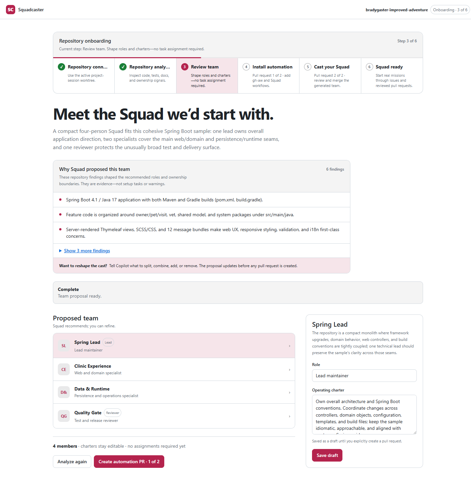
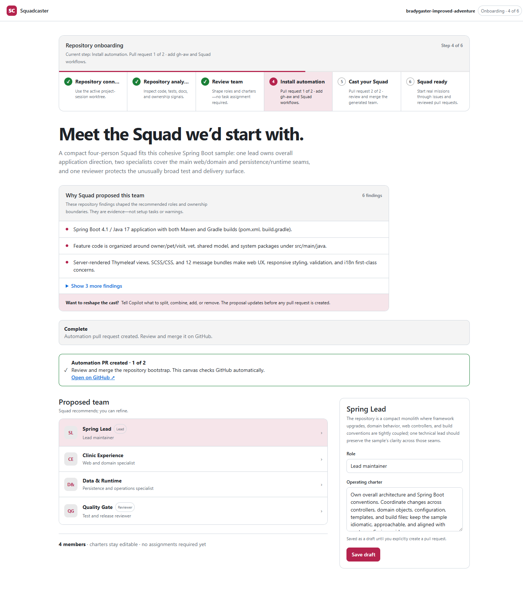
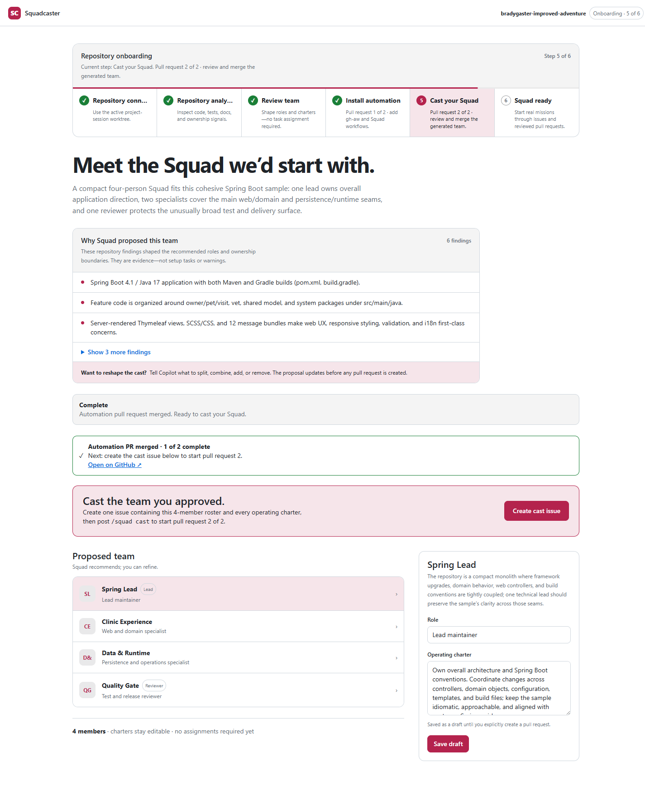
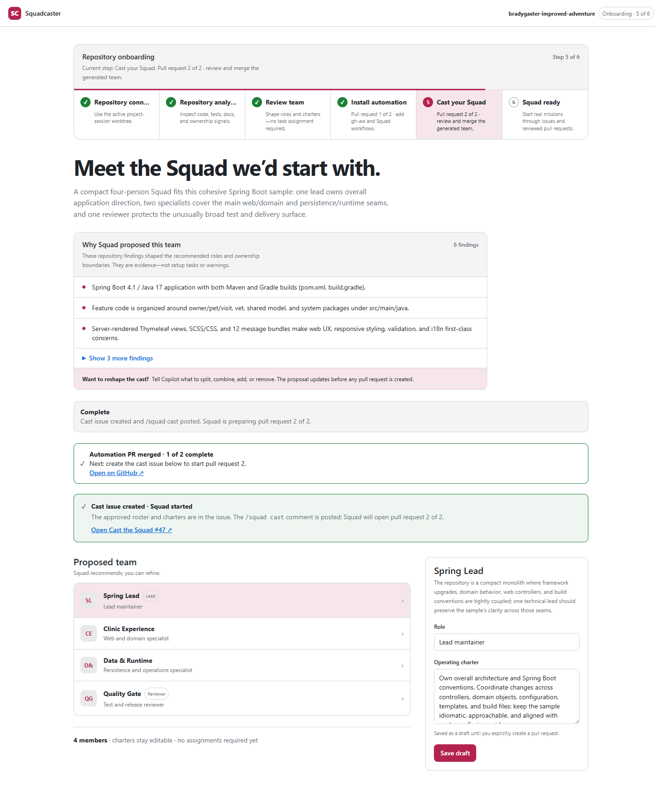
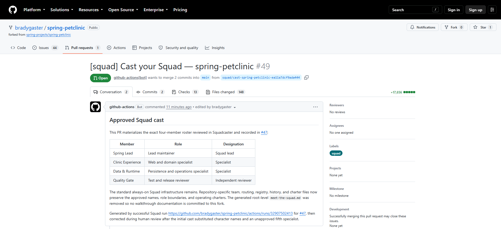
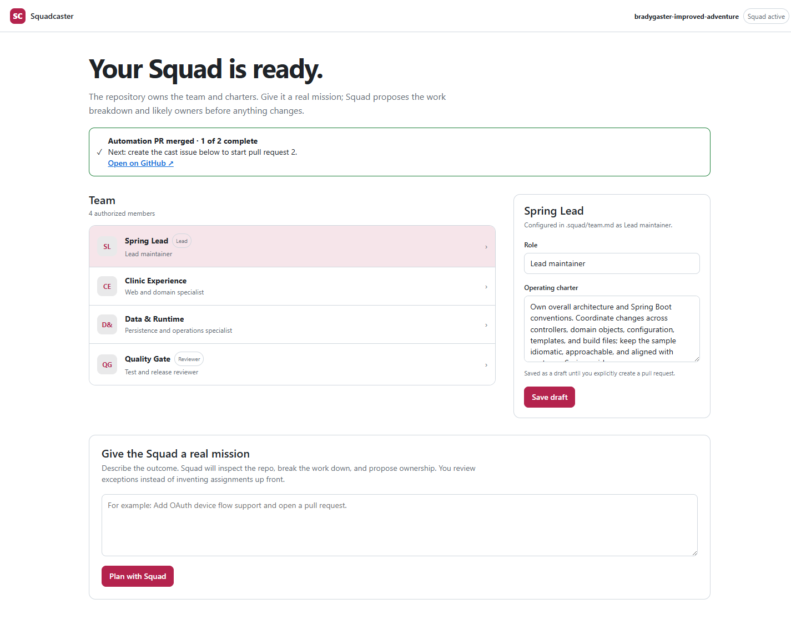
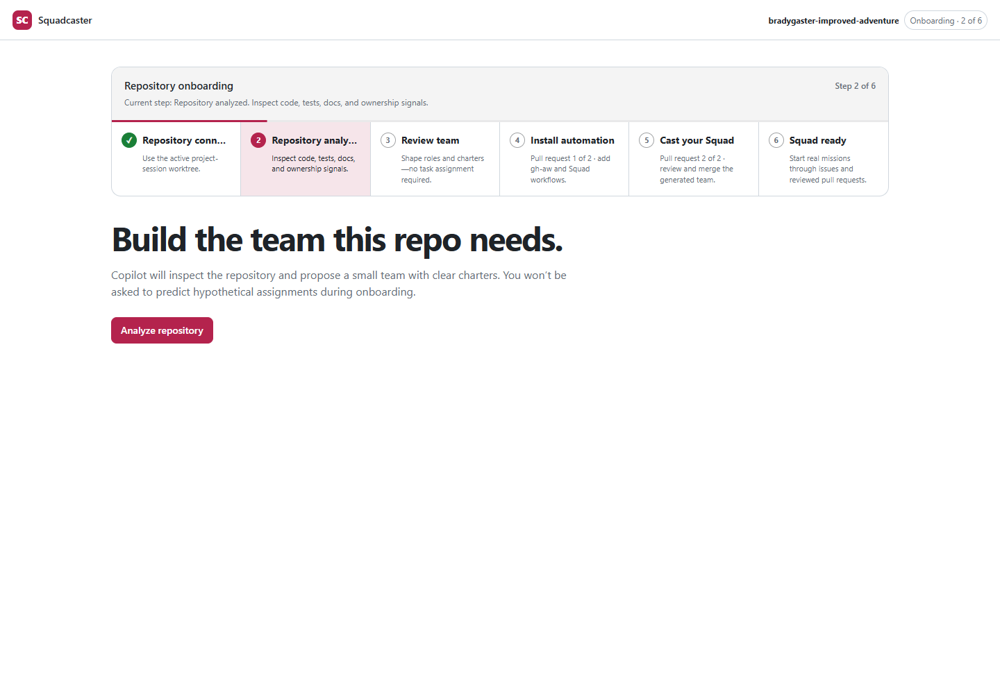
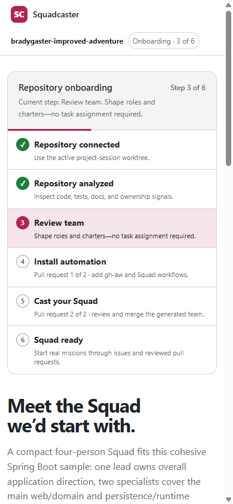

# Squadcaster

Squadcaster analyzes the active repository, proposes the smallest useful Squad, lets you reshape that team conversationally, and then guides two reviewed pull requests: one for automation and one for the approved cast. You decide when GitHub artifacts are created, review every change, and merge each pull request yourself.

<p align="center">
  
</p>

## Install

### Prerequisites

- GitHub Copilot with canvas extensions and an active project session for a Git repository
- [Git](https://git-scm.com/) and [GitHub CLI](https://cli.github.com/)
- An authenticated GitHub CLI session (`gh auth status`)

### Ask Copilot to install it

Paste this into Copilot:

```text
Install the Copilot extension from https://github.com/bradygaster/squadcaster/tree/main at user scope. Reload extensions from disk, then open the `squadcaster` canvas for my active project session.
```

### Install it manually

Clone the extension into your Copilot extensions directory:

```bash
mkdir -p "${COPILOT_HOME:-$HOME/.copilot}/extensions"
git clone https://github.com/bradygaster/squadcaster.git \
  "${COPILOT_HOME:-$HOME/.copilot}/extensions/squadcaster"
```

`COPILOT_HOME` defaults to `~/.copilot`. After cloning, ask Copilot:

```text
Reload extensions from disk, then open the `squadcaster` canvas for my active project session.
```

## Use it on a real repository

Open a repository in a Copilot project session, then paste:

```text
Open the `squadcaster` canvas for this active project session. Connect it to the current repository, analyze the repository, and propose the smallest useful Squad. Do not create any GitHub issue or pull request until I review and explicitly confirm the proposal.
```

The walkthrough below is an end-to-end run against the public fork [`bradygaster/spring-petclinic`](https://github.com/bradygaster/spring-petclinic). Squadcaster made no repository changes during analysis. GitHub writes began only after explicit confirmation, and nothing was auto-merged.

### 1. Analyze the repository

Choose **Analyze repository**. Copilot inspects code, tests, documentation, build structure, and ownership signals, then returns evidence and a repository-specific proposal. Analysis does not edit the repository or create GitHub artifacts.

### 2. Review and reshape the proposal

PetClinic produced this compact cast:

| Member | Role | Responsibility |
| --- | --- | --- |
| **Spring Lead** | Lead maintainer | Own overall architecture and Spring Boot conventions across the application. |
| **Clinic Experience** | Web and domain specialist | Own the web experience and the owner, pet, visit, and veterinarian domain seams. |
| **Data & Runtime** | Persistence and operations specialist | Own data access, database behavior, configuration, and runtime concerns. |
| **Quality Gate** | Test and release reviewer | Independently review tests, delivery behavior, and release readiness. |

Review the evidence, role boundaries, and each operating charter. Edit a role or charter and choose **Save draft** to persist it locally. Ask Copilot to split, combine, add, or remove roles to reshape the proposal conversationally. **Analyze again** refreshes the evidence and proposal without writing to GitHub.

### 3. Create and review automation PR 1 of 2

Choose **Create automation PR · 1 of 2**, review the confirmation, then choose **Create automation PR**. Squadcaster installs GitHub Agentic Workflows and all six supported Squad workflows: the dispatcher, implementation worker, reviewer, dependency worker, retrospective, and improvement worker. Each workflow source and generated lock file is treated as one contract; partial legacy installations remain incomplete.

The PetClinic run opened [automation PR #46](https://github.com/bradygaster/spring-petclinic/pull/46). **Open on GitHub** only navigates to the pull request; you review and merge it yourself. The `/squad` command surface remains inactive until the complete bootstrap PR is merged into the default branch.

<p align="center">
  
</p>

### 4. Create the cast issue

After the automation PR is merged, Squadcaster enables **Create cast issue**. The confirmation shows exactly what happens: one issue records the approved roster and every charter, then Squadcaster posts `/squad cast` to start pull request 2 of 2.

PetClinic recorded that source of truth in [cast issue #47](https://github.com/bradygaster/spring-petclinic/issues/47).

<p align="center">
  
</p>

### 5. Follow the casting run and review PR 2 of 2

Once the issue is created, the canvas reports **Cast issue created · Squad started** and links to the issue. Squad generates repository-owned team, charter, routing, and history files in a separate pull request.

The successful PetClinic run opened [cast PR #49](https://github.com/bradygaster/spring-petclinic/pull/49) with the exact four-member roster above. Review the files and checks on GitHub, then decide whether to merge it.

<details>
<summary>See the casting status and generated pull request</summary>

| Squadcaster status | GitHub pull request |
| --- | --- |
|  |  |

</details>

### 6. Start with a ready Squad

After the cast PR is merged, Squadcaster reads the repository-owned roster and charters and switches to the ready state. You can refine charters through another reviewed PR or give the Squad a real mission; Squadcaster proposes likely owners before any work begins.

<p align="center">
  
</p>

<details>
<summary>See the connection and mobile views</summary>

| Repository analysis | Responsive proposal |
| --- | --- |
|  |  |

</details>

## Development channel note

Squadcaster follows the [published Squad gh-aw onboarding contract](https://bradygaster.github.io/squad/docs/guide/gh-aw/) and installs the six explicit workflow sources from the moving `@dev` channel. Re-running onboarding uses the forced-add flow so existing generated sources are upgraded rather than silently retained, followed by strict compilation and verification of all six source/lock pairs.

Treat `@dev` as a development channel whose workflow contract can move. Generated `.lock.yml` files must never be edited by hand.

## Persistence and security boundaries

- **Local state:** proposals and drafts are stored in local Copilot extension or session artifact storage, keyed by a hash of the repository path.
- **Loopback renderer:** the canvas HTTP server binds only to `127.0.0.1` on an ephemeral port.
- **Explicit GitHub confirmation:** analysis is read-only. Creating the automation PR, cast issue, charter PR, or mission PR requires an explicit confirmation in the canvas.
- **Human-controlled merges:** Squadcaster opens reviewable pull requests and monitors their status; it never merges them, changes Actions settings, or bypasses branch protection.

## How it is organized

- `extension.mjs` — canvas provider, persistence, GitHub operations, and agent tools
- `renderer.mjs` — responsive onboarding and team-management interface
- `copilot-extension.json` — extension install and share manifest

## License

[MIT](LICENSE)
